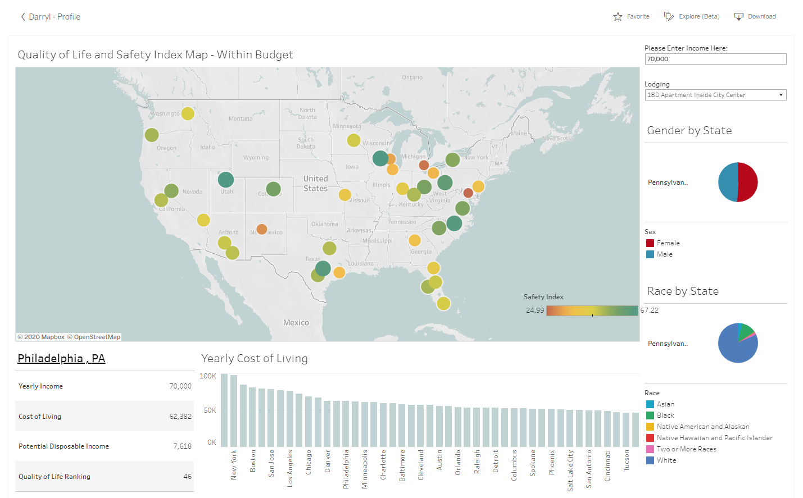

# GroupProject-Cost_of_Living_with_Tableau
This repository has been copied from it's original location [HERE](https://github.com/Mahamoud8/Final-Project), so that future updates and changes made by me will not effect the other authors. To see ALL commits to the project please refer to the original.

This projects attempts to create a tool that shows a breakdown of major cities around the United States. For each city, the map displays the estimated yearly cost of living, racial demographics by state, gender demographics by state, safety rating and quality of like ranking by city. The tool also allows you to input your yearly salary and living situation and determine approximately how much yearly disposable income you could expect to have. Such a tool can assist with numerous things, such as, life events like moving or job searching.

### Data
* [Bureau of Labor Statistics](https://www.bls.gov/)
* [Numbeo](https://www.numbeo.com/cost-of-living/)

---
### Tech Stack
* Tableau
* Python
* Jupyter Notebook
* Excel

### User Instructions
* Clone the repository: git clone https://github.com/DarrylB32/GroupProject-Cost_of_Living_with_Tableau.git 
* Follow link to Tableau Dashboard [HERE](https://public.tableau.com/profile/darryl4039#!/vizhome/FinalProject_16052353135520/Dashboard1?publish=yes)

### Authors
* Darryl Baynes
* [Beth Kaczor](https://www.linkedin.com/in/bethkaczor/)
* [Elisa Trejo](https://www.linkedin.com/in/elisa-trejo-5b06b81a9/)
* [Mahamoud Hassan](https://www.linkedin.com/in/mahamoud-hassan-m-2a079912b/)
* [Calvin Brown](https://www.linkedin.com/in/calvin-d-brown/)

### Additional Notes
The [ETL](ETL.ipynb) file details the Extraction and Transformation of the data that was used in the Tableau Dashboard